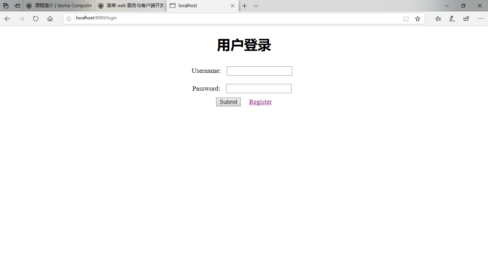
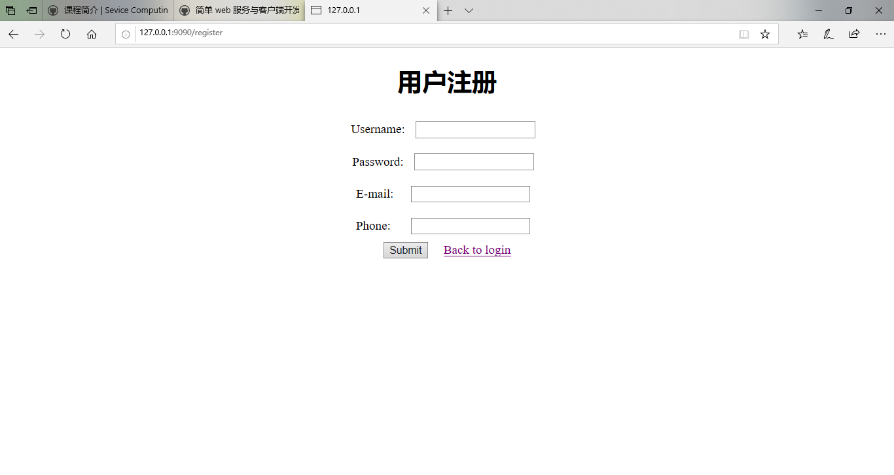
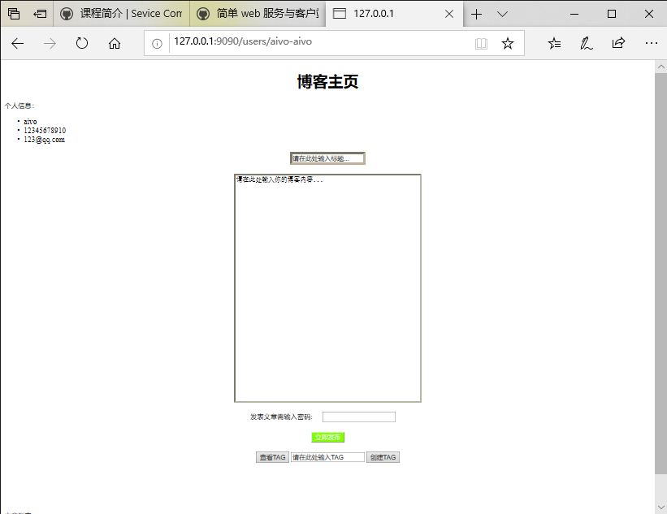
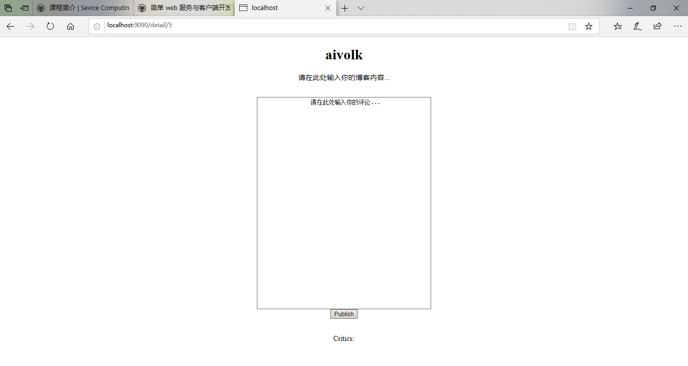

## 博客项目简介

#### 成员信息
|            姓名             |            学号             |
| :-----------------------------: | :-----------------------------: |
| 杨浩 | 17343137 |
| 杨泽涛  | 17343140 |
| 吴明章 | 17343119 |

#### 运行说明
在命令行运行： 
$ go run main.go 
之后在浏览器访问： 
http://localhost:9090/login 
 
#### 相关技术与框架 
前端采用Vue.js框架，后端采用boltDB数据库 
 
#### 四个界面 
1. 登录界面：输入用户名和密码进行登录 
2. 注册界面：输入用户名、密码、邮箱和手机号进行注册 
3. 用户主页：含有用户信息和博客列表，可以发表文章、进入博客详情页面 
4. 博客详情页面：包含博客内容，可以发表评论 
 
#### 相关url 
所有的url响应如下，     
	mymux.HandleFunc("/register", Register1).Methods("GET"): 返回注册界面     
	mymux.HandleFunc("/register/{username}-{password}-{email}-{phone}", Register2).Methods("POST"): 返回"YES"或"NO"代表是否注册成功    
	mymux.HandleFunc("/login/{username}-{password}", Login2).Methods("POST"): 返回YES或NO代表是否登录成功    
	mymux.HandleFunc("/login", Login1).Methods("GET"): 返回登录界面    
	mymux.HandleFunc("/users/{username}-{password}", Userinfo).Methods("GET"): 返回用户主页    
	mymux.HandleFunc("/articles/{username}", getAllarticles).Methods("GET"): 返回指定用户的所有博客    
	mymux.HandleFunc("/critics/{Id}", getAllcritics).Methods("GET"): 返回指定博客的所有评论    
	mymux.HandleFunc("/publish/{username}-{password}", CreateArticle).Methods("POST"): 返回"YES"或"NO"代表是否发布博客成功     
	mymux.HandleFunc("/publish/critic", CreateCritic).Methods("POST"): 返回YES或NO代表是否发表评论成功    
	mymux.HandleFunc("/detail/{Id}", GetArticle).Methods("GET"): 返回指定博客的内容     
	mymux.HandleFunc("/tag/{tagcontent}", CreateTag).Methods("POST"): 返回YES或NO代表是否成功创建标签     
	mymux.HandleFunc("/tag", GetTag).Methods("GET"): 返回标签    
     
#### 数据库表 
1. User表：用户个人信息    
    Key: Username(唯一的用户名)    
    Field: Username, Password,  Email, Phone    
2. Article表：博客文章信息    
    Key: Id(博客Id是唯一的)    
    Field: Id, Title, Content, Author    
3. Critic表：    
    Key: C_id(评论的唯一ID)    
    Field: C_id, Id, Content    
4. MyTag表：文章标签信息    
    Key: Tagname    
    Field: Tagname    
 
#### 界面展示 
|            登录页面             |            注册页面             | 
| :-----------------------------: | :-----------------------------: | 
|  |  | 
|           用户界面           |           博客详情界面           | 
|  |  | 
 
#### 加分项——Token认证 
 
基于Token的身份验证的过程如下: 
 
1. 用户通过用户名和密码发送请求。 
2. 程序验证。 
3. 程序返回一个签名的token 给客户端。  
4. 客户端储存token,并且每次用于每次发送请求。 
5. 服务端验证token并返回数据。 
